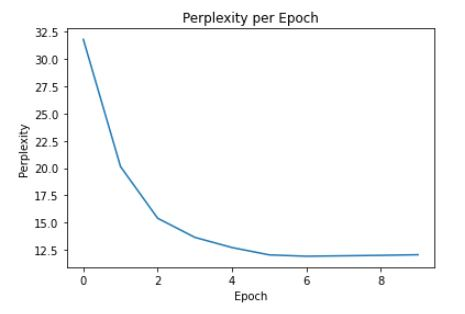

# ANNOTATED ENCODER-DECODER WITH ATTENTION

This is implementation of Neural Language translator(German to English) using Attention Mechanism

- Reference: https://bastings.github.io/annotated_encoder_decoder/


# Model Creation

**Notebook:** /notebooks/S11_Attention.ipynb [(Link)](notebooks/S11_Attention.ipynb)

**Encoder Decoder Network:** /notebooks/models/attention_net.py [(Link)](notebooks/models/attention_net.py)

**Notebook:** /notebooks/S11_Attention_Inferencing.ipynb [(Link)](notebooks/S11_Attention_Inferencing.ipynb)


## Model Performance

**perplexity per epoch**



**Sample Translation Result**

```
Src :  mein vater hörte sich auf seinem kleinen , grauen radio die <unk> der bbc an .
Trg :  my father was listening to bbc news on his small , gray radio .
Pred:  my father heard on his little , <unk> radio shack the <unk> of the bbc .
```