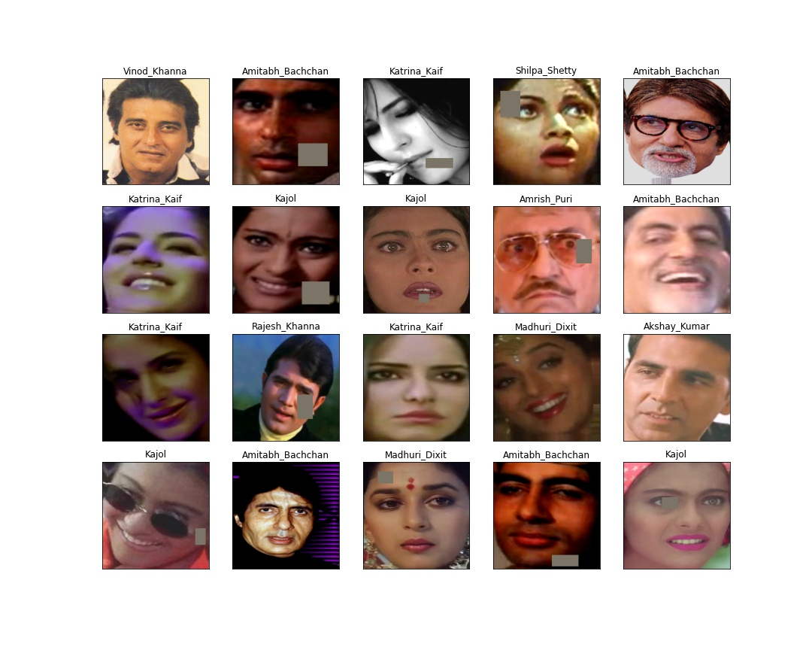
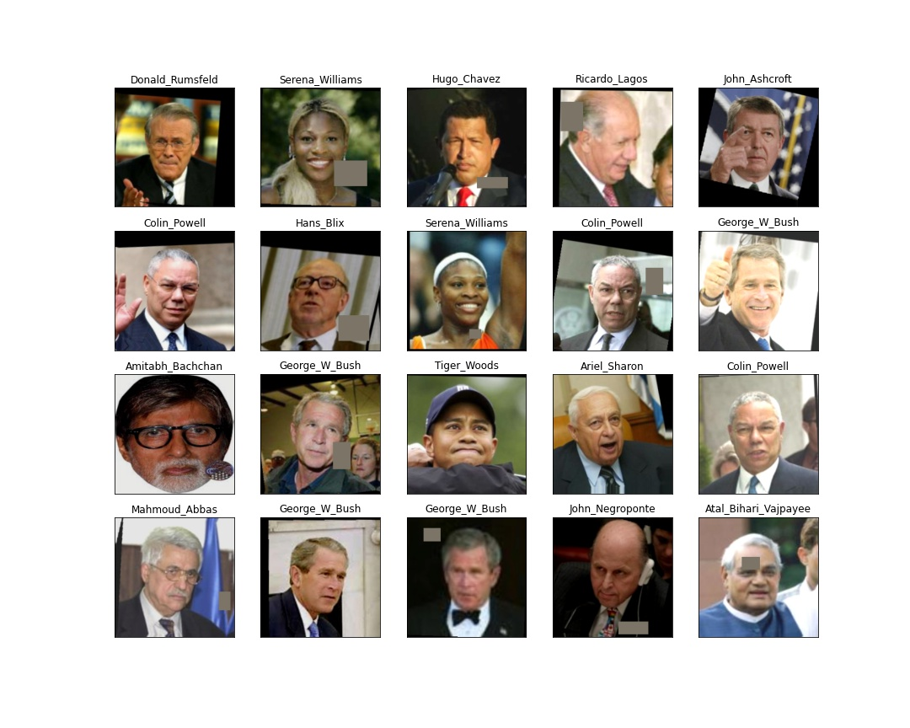
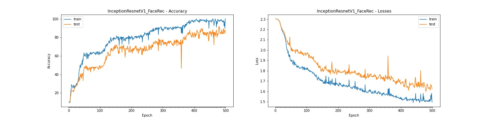
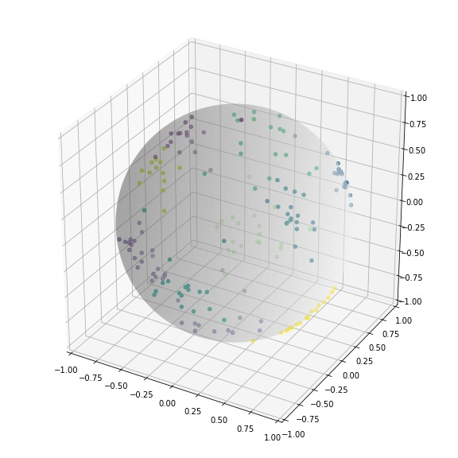

# FACE RECOGNITION

**This is face Recognition solution to recognize 10 bollywood stars. Around 25 face images of each of the movie star are collected from google images and IMFDB site.
These data is add to the existing LFW dataset. The model is built using pre-trained InceptionResnetV1 network which is trained on vggface2 dataset.
The purpose of using the pre-trained model is to reuse the already learned weights from millions of images on vggface2 dataset**


# Web Applications

The model is deployed on AWS Lambda using serverless computing framework and the web application is hosted on AWS S3 bucket

**Web Application:** https://s3.ap-south-1.amazonaws.com/www.aijourney.com/eva4p2/s4/s4_fr.html


# Work Summary

* Dataset Link: [(boolywood_stars dataset)](https://drive.google.com/file/d/1S3C9DjLRLd-ebV6j7PcGYudqJFcpbjrJ/view?usp=sharing)
* AWS Deployment: [(AWS Lambda function and deployment code)](aws_deployment/s4-face-recognize-aws)

## Sample Dataset

25 Front face images of following 10 bollywood starts are collected:/ 
**Akshay Kumar, Amitabh Bachchan, Amrish Puri, Anil Kapoor, Kajol,**/
**Katrina_Kaif, Madhuri Dixit, Rajesh Khanna, Shilpa Shetty, Vinod Khanna**

Image transformations are applied to the dataset. Dataset is resize to 3X224X224 with following transformation:
```python
train_tf = albumentations.Compose([
                    albumentations.Resize(self.size,self.size),
                    albumentations.RandomBrightness(limit=0.2, p=0.5),
                    albumentations.RandomContrast(limit=0.2, p=0.5),
                    albumentations.Rotate(limit=(-10,10), p=0.70),
                    randomCrop[0], randomCrop[1],
                    albumentations.HorizontalFlip(p=0.7),
                    albumentations.ElasticTransform(sigma=50, alpha=1, alpha_affine=10,p=0.10),
                    albumentations.CoarseDropout(max_holes=1, max_height=64, max_width=64, min_height=16, min_width=16, fill_value=fill_value, p=0.70),
                    albumentations.Normalize(mean=self.means, std=self.stds),
                    ToTensor()
        ])
```
**Here is sample images of own collected bollywood star images after image transformations**


**Sample of LFW dataset after image transformation**


## Attempt-1: Custom images are added to LFW dataset and model is trained
 
**Notebook:** S4_FaceRecognition_Attempt1_LFW.ipynb [(Link)](notebooks/S4_FaceRecognition_Attempt1_LFW.ipynb)

**Challenges:**
1. LFW dataset have 5749 classes and most of the classes have only one images.
2. Only those classes are considered for model building which contains atleast 20 images. Hence 62 classes from LFW dataset are considered for the work
3. Total of 72 classes are used for model building. 62 from LFW and 10 custom classes. 

Model is trained for 100 epochs but model performance is saturated and not able to achieve above 38% accuracy

```Result
Training best result: Accuracy: 39.44 at Epoch 100
Testing  best result: Accuracy: 38.02 at Epoch 90
Accuracy Gap: 1.42
```

## Attempt-2: Only Custom images are used for training
 
**Notebook:** S4_FaceRecognition_Attempt2_BW_STARS.ipynb [(Link)](notebooks/S4_FaceRecognition_Attempt2_BW_STARS.ipynb)

**Model Performance**

```Result
Training best result: Accuracy: 100.00 at Epoch 407
Testing  best result: Accuracy: 92.00 at Epoch 479
Accuracy Gap: 8.00
```



**Plotting Embedding Vector**\
Embedding vector of size 3 is used and below shows how each images are positions




