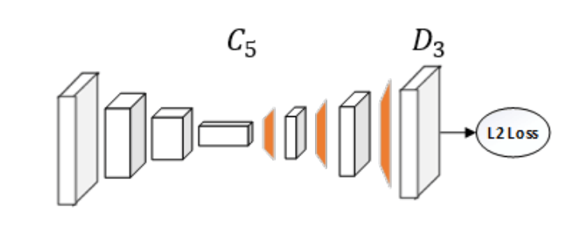

# Description about Paper: https://arxiv.org/pdf/1804.06208.pdf

**The purpose of this document is to understand model architecture and JointMSeLoss class as explained in the paper and extract important element of the networks design.**

**This paper aims to ease this problem by asking a question from the opposite direction, \
  how good could a simple method be?**
 

 

**This paper aims to ease this problem by asking a question from the opposite direction, \
  how good could a simple method be?**
 

Due to rising complexity of model architecture for HPE, this paper aimed to provides simple and effective baseline methods.

## Model Architecture

The model architecture is based on a few deconvolutional layers added on a backbone network, ResNet and this ease the way to estimate heat maps from deep and low resolution maps.
It make use of  optical flow based pose propagation and similarity measurement.

**Pose Estimation Using A Deconvolution Head Network**

This simple baseline method is using ResNet as backbone network for image feature extraction and simply adds a few deconvolutional layers over the last convolution stage in the ResNet, called C5.

Let's have a quick summary of other network to understand the basic differences:

Hourglass: It features in a multi-stage architecture with repeated bottom-up, top-down processing and skip layer feature concatenation.

Cascaded pyramid network (CPN): It also involves skip layer feature concatenation and an online hard keypoint mining step.

Key difference is in how high resolution feature maps are generated. Hourglass and CPN uses upsampling to increase the feature map resolution and put convolution parameters in other blocks.
In contrary, the **simple baseline method** combines the upsampling and convolution parameters into deconvolution layers without using skip layer connections.

Model uses three upsampling steps and also three levels of non-linearity are used to obtain high-resolution feature maps and heatmaps.

**The method uses Pose Tracking Based on Optical Flow**

For Multi-person pose tracking in videos, it first estimate human poses in frames, and then tracks these human poses by performing greedy matching algorithms frame by frame and assigning a unique identification number to those frames.
Simple Baseline Method follow the same approach with two differences:

### 1.  Joint propagation using optical flow

It use two different kinds of human boxes, one is from a human detector and the other boxes generated from previous frames using optical flow.
When the processing frame is difficult for human detectors that could lead to missing detections due to motion blur or occlusion, we could have boxes propagated from previous frames where people have been detected correctly

**Benefits:**
- The joint propagation improves finding more persons that are missed by the detector, possibly due to motion blur or occlusion in video frames

### 2. It use flow-based pose similarity metric for greedy matching algorithm

- **IoU as the similarity metric:** this metric could be problematic when an instance moves fast thus the boxes do not overlap, and in crowed scenes where boxes may not have the responding relationship with instances.
- **Pose Similarity**: A more fine-grained metric , which calculates the body joints distance between two instances using Object Keypoint Similarity (OKS). It could also be problematic when the pose of the same person is different across frames.
due to pose changing.

To deal with challenges posed by above metrics, this simple baseline method make use of flow base pose similarity where it use multiple frames to propagate similarity to next frame and could relink instances even disappearing in the middle frame.

**Benefits:**
1. flow-based pose similarity is better than bounding box similarity when person moves fast and their boxes do not overlap
2. workwell when when people in frames are lost shortly due to occlusion and appear again.
 
With the joint propagation using optical flow and the flow-based pose similarity, the Author propose the flow-based pose tracking algorithm combining these two.

For the processing frame in videos, the boxes from a human detector and boxes generated by propagating joints from previous frames using optical flow are unified using a bounding box
Non-Maximum Suppression (NMS) operation. The boxes generated by propagating joints serve as the complement of missing detections of the detector.

