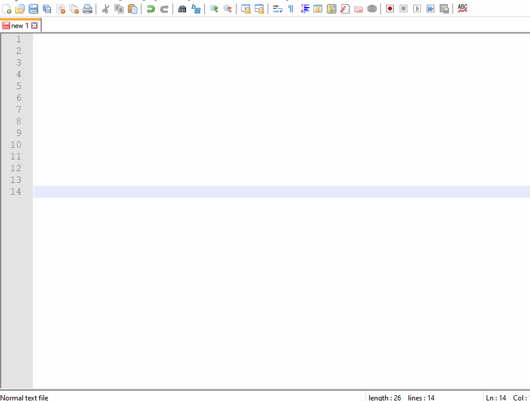
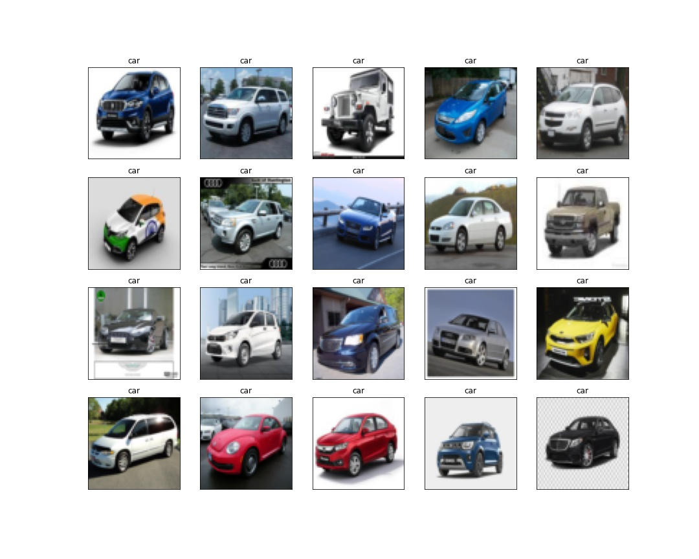
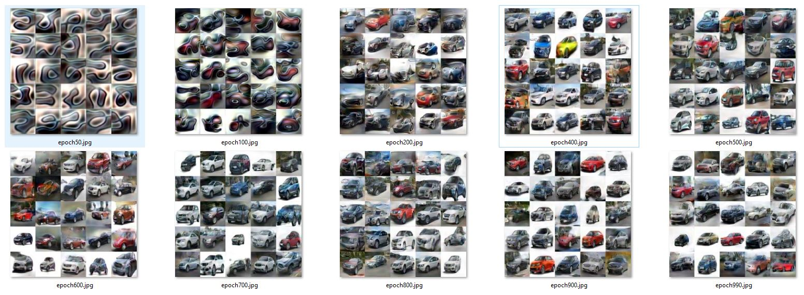
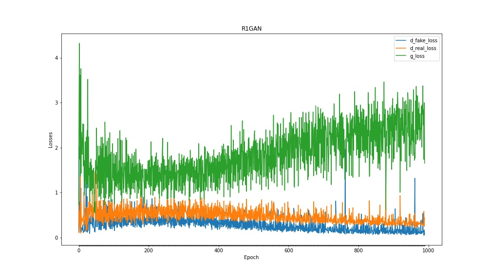

# GENERATIVE ADVERSARIAL NETWORL

**This is implementation of GAN with R1 Regularizer to generate India Car images. GAM network is build on 700+ car dataset collected through google images.**

# Web Applications

The model is deployed on AWS Lambda using serverless computing framework and the web application is hosted on AWS S3 bucket

**Web Application:** https://s3.ap-south-1.amazonaws.com/www.aijourney.com/eva4p2/s6_gan.html

##



## Dataset [(link)](https://drive.google.com/file/d/1RT85hbmnCWRHu4Dl9EsJ38urlD1O0KkZ/view?usp=sharing)

700+ Indian car images are collected from google images. For simplicity, car with front facing and specific angle position are collected.

Dataset Size: 704



## GAN Model Creation
 
**Notebook:** S6_R1GAN_Car.ipynb [(Link)](notebooks/S6_R1GAN_Car.ipynb)

```python
batch_size=64
epochs=1000
n_noise = 256 # noise vector size for Generator
```

**Epoch Results**



**Real and Fake Discriminitive losses**


**Generative and Discriminitive Losses**


