## Session-2: 
* **Creating dataset for different type of Drones and flying birds**
* **Build Neural Network for classifying images using Transfer-Learning for Pre-Trained MobileNet_V2 Network**

## Dataset Creation
1. Total of 21805 images are collected through various sources (Google images, Bing, Flickr,  yahoo, DuckDuckGo)
2. Images are categorized under four category as:
   1. Large QuadCopters (LQC)
   2. Small QuadCopters (SQC)
   3. Winged Drone      (WD)
   4. Flying Birds      (FB)

**Class distribution**

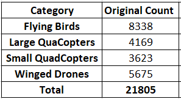

**Sample Dataset**

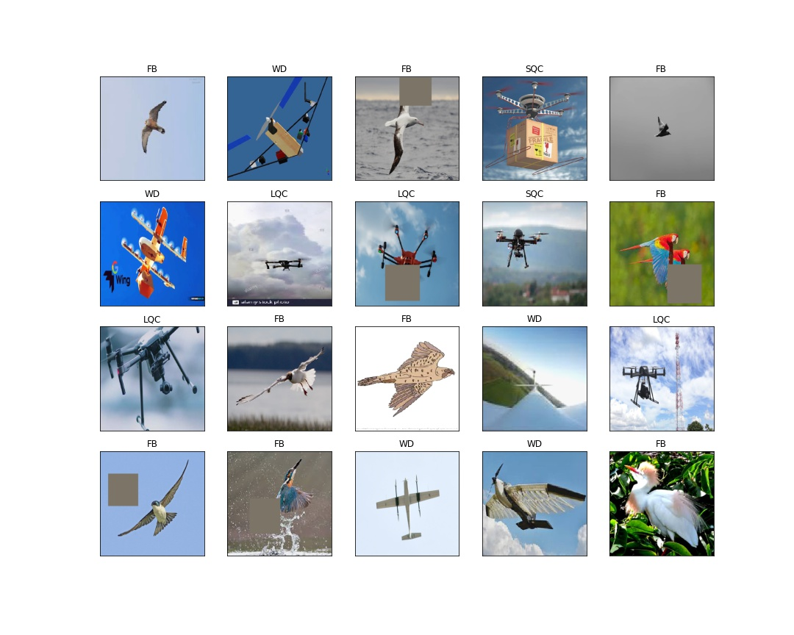
 

## Exploratory Data Analysis and Data Handling[(Link)](eda_find_duplicates.ipynb)

For Detailed work on EDA refer notebook eda_find_duplicates.ipynb[(Link)](eda_find_duplicates.ipynb)
This notebook captured duplication and errornous information against each image file and these information is 
finally dumped into **eda_duplicate_list.csv[(Link)](eda_duplicate_list.csv)**

The existing dataset comes with various challenges:
1. Dataset contains few Non-Media files(.txt, .ipynb) and few erronous file of type .GIF, .JFIF and .svg
2. There are many duplicates images within the class
3. There are few duplicate images across the classes
4. There are cases where images are misclassified
5. Dataset are of different resolutions

### Non-Media files and errornour files

Theses images are removed from the dataset

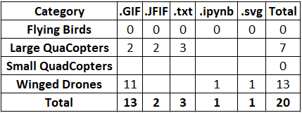

### Handling of Duplicate Images Within Class

To identify the duplicate images, md5 algorithm(using hashlib package) is used to calculate the hash for each file and hash key is compared to identify the duplicate images.
All duplicate images are removed from the dataset.

Total of 2258 duplicate images are found in the dataset.
Distribution of duplicates images are as below:

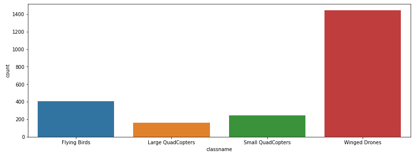

### Handling of Duplicate Images Across Classes
It is also observed that same images are found to be present in multiple classes

Total of 104 duplicate images are found across classes in the dataset. These duplicate images are deleted from the dataset

Here is the summary of duplicate images across classes:

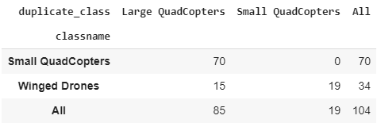

### Misclassified Images

Many images are found to be wrongly labels. Below are the few samples of misclassified images

**Small QuadCopters:** Below images are found in Small QuadCopters but these images are actually belongs to Large QuadCopter class

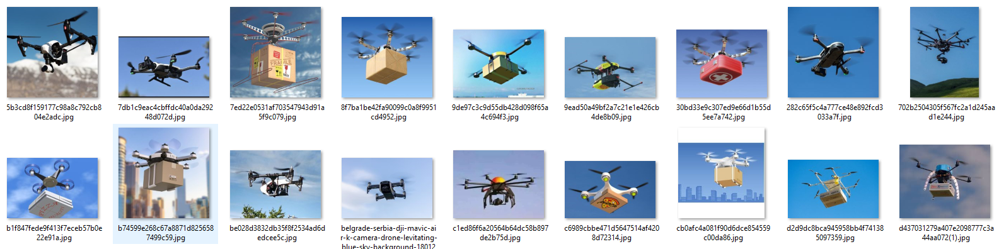

**Winged Drones:** Below images are found in Winged Drone but these images are actually belongs to either Small or Large QuadCopter class

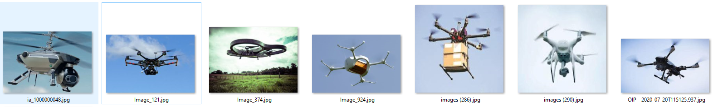
 

These misclassified images are retained in the dataset.

### Final Dataset Size

After removing non-media files, errornous images and all duplicate images from the dataset, here is the final dataset size used for building the model.

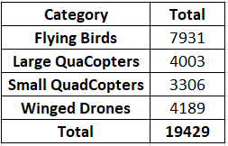
 

### Handling of Multi-Resolution Images

This section required to be updated

## Model Building Using Transfer Learning (MobileNet_V2)

### Attempt-1: S2_main_attempt1.ipynb[(Link)](S2_main_attempt1.ipynb)

In this expereiment MobileNet_V2 network is used as an feature extracter and all the layer are Freezed and made non-trainable.
We don not need last classifier layer and it is replaced by own fully connected dense layer for classifying four categogy of images.

## Test Results:

Over all Test Accuracy: 87.75% at Epoch: 29

Class based accuracy:

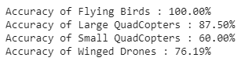
 

Accuracy and Loss Graph:

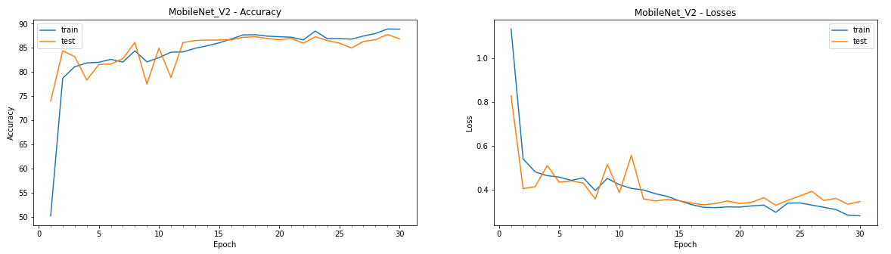
 

### Attempt-2: S2_main_attempt2.ipynb[(Link)](S2_main_attempt2.ipynb)

In this expereimen, MobileNet_V2 network is fine-tuned where the last 3 blocks (features:16, features:17 and features:18) are un-freezed so that their weights 
get learned and updated in each epoch during training. and the last classifier layer is replaced by own fully connected dense layer for classifying four categogy of images.

## Test Results:

Over all Test Accuracy: 88.93% at Epoch: 8

Class based accuracy:

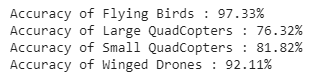
 

Accuracy and Loss Graph:

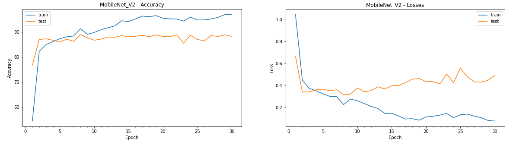
 

## Sample of Misclassification Results on Test Data

**Example of Small QuadeCopters which are misclassified by the model:**

 

**Example of Large QuadeCopters which are misclassified by the model:**

 

**Example of Winged Drones which are misclassified by the model:**

 

**Example of Flying Birds Drones which are misclassified by the model:**

 

