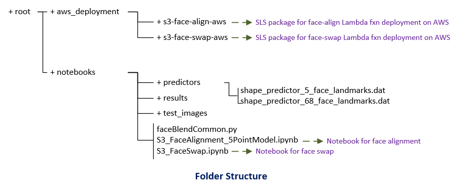
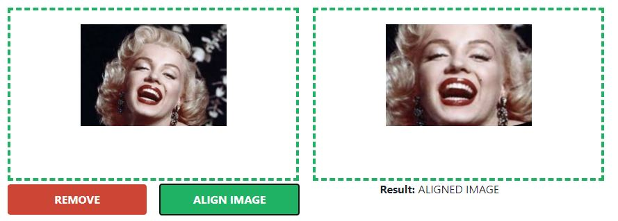
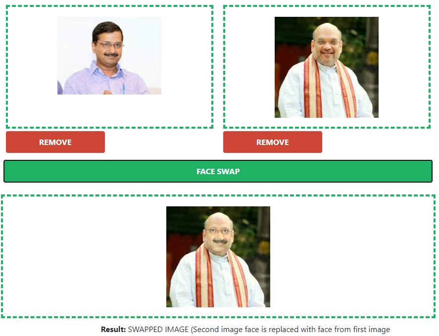
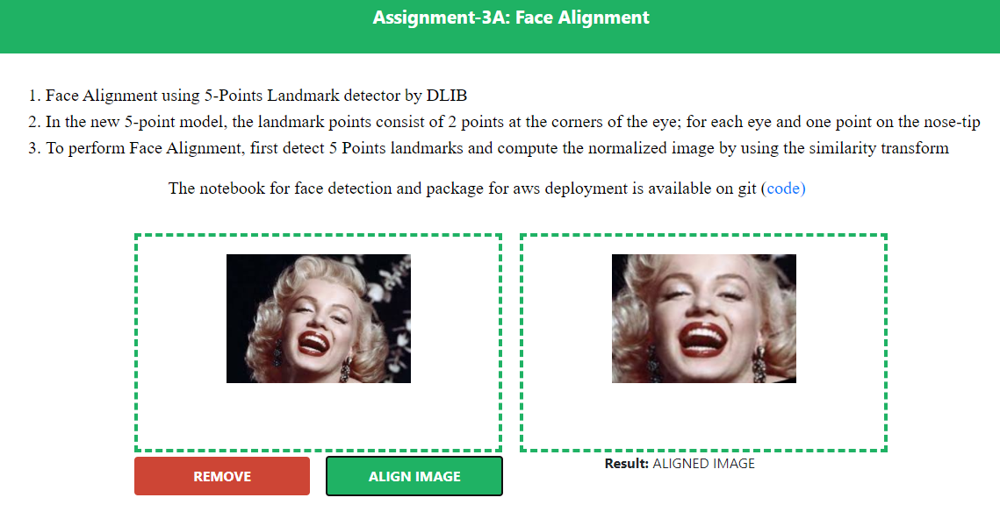
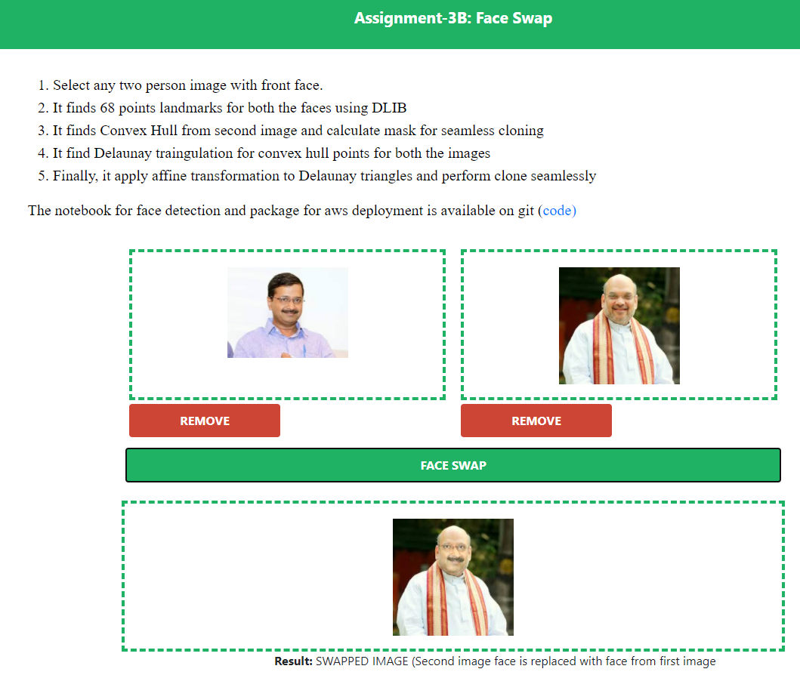

## Session-3: 
* **Face Alignment**
* **Face Swaping**
* **Using Serverless framework, Lambda function for the model is deployed onto AWS**
* **Web page application is hosted on AWS S3 bucket**


## Web Applications

All the web applications are hosted on AWS S3 bucket

1. ### Web App for Image Classification) [(Visit)](https://s3.ap-south-1.amazonaws.com/www.aijourney.com/eva4p2/s1_demo.html)
   **Image Classification Web Link:** https://s3.ap-south-1.amazonaws.com/www.aijourney.com/eva4p2/s1_demo.html

2. ### Web App for Drone Classification using MobileNet_V2 pre-trained model [(Visit)](https://s3.ap-south-1.amazonaws.com/www.aijourney.com/eva4p2/s2_demo.html)
**Drone Classification Web Link:** https://s3.ap-south-1.amazonaws.com/www.aijourney.com/eva4p2/s2_demo.html

3. ### Web App for Face Alignment [(Visit)](https://s3.ap-south-1.amazonaws.com/www.aijourney.com/eva4p2/s3_face_align.html)
**Face Align Web Link:** https://s3.ap-south-1.amazonaws.com/www.aijourney.com/eva4p2/s3_face_align.html

4. ### Web App for Face Swap [(Visit)](https://s3.ap-south-1.amazonaws.com/www.aijourney.com/eva4p2/s3_face_swap.html)
**Face Swap Web Link:** https://s3.ap-south-1.amazonaws.com/www.aijourney.com/eva4p2/s3_face_swap.html


## Work Summary

### Package Structure

<p align="center"></p>

## Face Alignment

* Face Alignment using 5-Points Landmark detector by DLIB
* In the 5-point model, the landmark points consist of 2 points at the corners of the eye; for each eye and one point on the nose-tip
* To perform Face Alignment, first detect 5 Points landmarks and compute the normalized image by using the similarity transform

Notebook: S3_FaceAlignment_5PointModel.ipynb [(Link)](notebooks/S3_FaceAlignment_5PointModel.ipynb)

AWS Deployment: [(Link)](aws_deployment/s3-face-align-aws)

Result of test images with face alignment on web application

<p align="center"></p>


## Face Swap

* Select any two person images with front face.
* It finds 68 points landmarks for both the faces using DLIB
* It finds Convex Hull from second image and calculate mask for seamless cloning
* It find Delaunay traingulation for convex hull points for both the images
* Finally, it apply affine transformation to Delaunay triangles and perform clone seamlessly

Notebook: S3_FaceSwap.ipynb [(Link)](notebooks/S3_FaceSwap.ipynb)

AWS Deployment: [(Link)](aws_deployment/s3-face-swap-aws)

Result of test images with face swap on web application

<p align="center"></p>

**API Request Message**
Images are encoded into base64 format and send as string on JSON message.
* METHOD: POST
* Content-Type: application/json
* Json message body containing base64 encoded data for two image files

```
# img1_base64 and img1_base64: this contains image data in base64 encoded format

{
	"img1": img1_base64,
	"img2": img2_base64
}
```

**API Response Message**
```
# Function to convert numpy image data into base64 encoded format for web ui
def img_to_base64(img):
    img = Image.fromarray(img, 'RGB') 
    buffer = io.BytesIO()
    img.save(buffer,format="JPEG")
    myimage = buffer.getvalue()                     
    img_str = f"data:image/jpeg;base64,{base64.b64encode(myimage).decode()}"
    return img_str

# swapped image data is convered into base64 encoded format for rendering on HTML
swapped_face = get_face_swap(image_bytes1=im1, image_bytes2=im2)
im_base64 = img_to_base64(swapped_face)

# Response Message Body
{
	"swappedFacImg": im_base64,
	"img2": img2_b64
}
```

## Testing Stategy

File: test_handler.py [(Link)](aws_deployment/s3-face-swap-aws/test/test_handler.py)

test function is developed which create and pass input message as expected by entry function main_handler in handler.py 

```
def test_handler(filename1, filename2):

    # read and convert image into base64
    img1 = Image.open(filename1)
    img1 = np.array(img1)
    im1_str = img_to_base64(img1).split(',')[1]

    # read and convert image into base64
    img2 = Image.open(filename2)
    img2 = np.array(img2)
    im2_str = img_to_base64(img2).split(',')[1]

    body = json.dumps({"img1": im1_str, "img2": im2_str})
    resp = main_handler({
        'headers': {'content-type': 'application/json'},
        'body': body
    }, '')
    resp_body = json.loads(resp['body'])
    print(resp['statusCode'])
    print(resp_body)
    assert resp['statusCode'] == 200

if __name__ == '__main__':
    print("Running test..")
    test_handler(FILE1_PATH, FILE2_PATH)
```
## Face Aligment Web Application

**Face Align Web Link:** https://s3.ap-south-1.amazonaws.com/www.aijourney.com/eva4p2/s3_face_align.html

<p align="center"></p>


## Face Swap Web Application
**Face Swap Web Link:** https://s3.ap-south-1.amazonaws.com/www.aijourney.com/eva4p2/s3_face_swap.html

<p align="center"></p>


